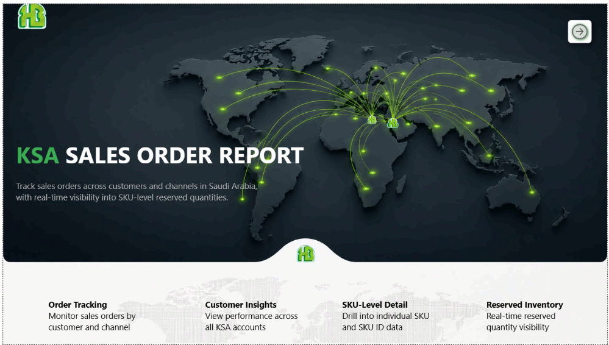
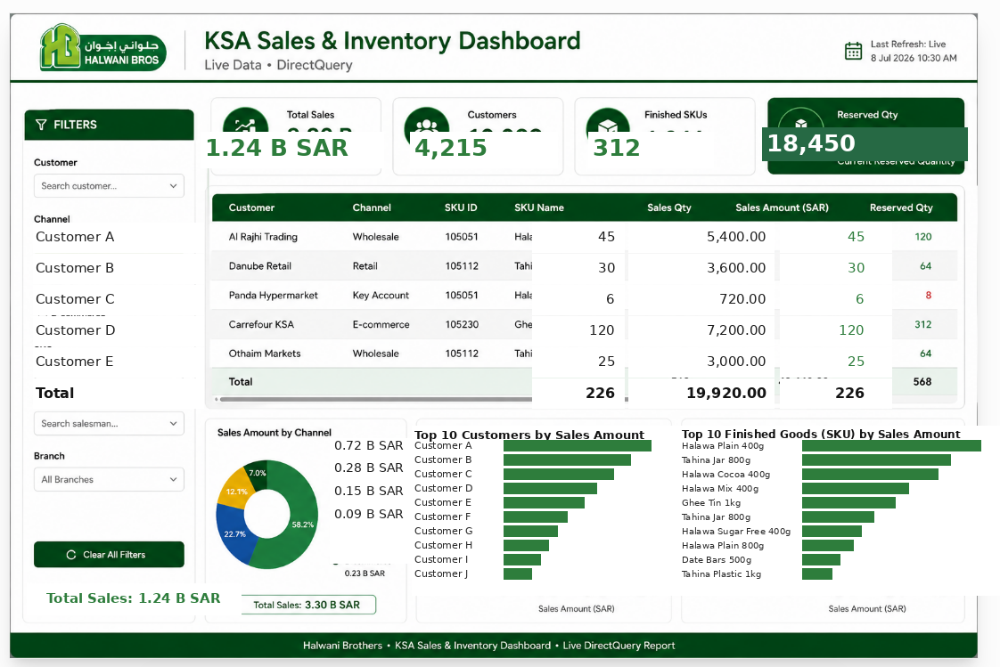
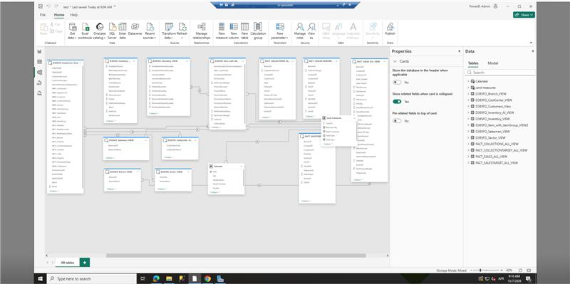

# KSA Sales & Inventory Dashboard — Power BI Case Study

A live, DirectQuery-connected Power BI dashboard built to track sales orders, customer performance, and reserved inventory across the Saudi Arabia (KSA) market for an FMCG business, sourced from a Dynamics 365 Finance & Operations (D365FO) ERP backend.

> **Note on data:** All figures, customer names, and quantities shown in the screenshots below are synthetic placeholders. This repository documents the architecture, data model, and design decisions only — no proprietary business data is included or reproduced.

## Overview

The dashboard gives sales and operations stakeholders real-time visibility into:
- Sales orders by customer and channel (Wholesale, Retail, Key Account, E-commerce)
- SKU-level sales quantity and revenue
- Reserved inventory quantities tied to open orders
- Channel and customer-level performance breakdowns

## Dashboard

**Key features:**
- **Live DirectQuery** connection — no import/refresh lag, reflects ERP state in real time
- **Multi-level filtering** — customer, channel, SKU, salesman, and branch
- **KPI cards** for total sales, customer count, active SKUs, and reserved quantity
- **Channel mix** visualized via donut chart
- **Top-N breakdowns** for customers and finished goods by sales amount

## Data Model

Built on a star-schema-oriented semantic model sourced from D365FO views, including:
- Fact tables: `FACT_SALES_ALL_VIEW`, `FACT_SALESTARGET`, `FACT_COLLECTIONS_ALL_VIEW`, `FACT_COLLECTIONTARGET_ALL_VIEW`
- Dimension views: Customer, Branch, Salesman, Sector, Item/Item Group, Inventory
- A shared `Calendar` dimension for time intelligence across all fact tables
- Mixed storage mode (DirectQuery + Import) balancing freshness and performance

**Modeling considerations addressed:**
- Avoided fan-trap risk between sales and collections facts by keeping them on separate grains, joined only through shared dimensions
- Kept inventory and reserved-quantity views at consistent SKU-level granularity to prevent double-counting in visuals

## Tech Stack

- **Power BI** (Power Query, DAX, composite/mixed storage mode)
- **Dynamics 365 Finance & Operations** (data source, via views)
- **DirectQuery** for real-time refresh
- Star-schema-oriented dimensional modeling (Kimball-style)

## Author

Ahmed Elbahrawy — Data Engineer / Analytics Engineer
[GitHub](https://github.com/ahmed-elbahrawy)
